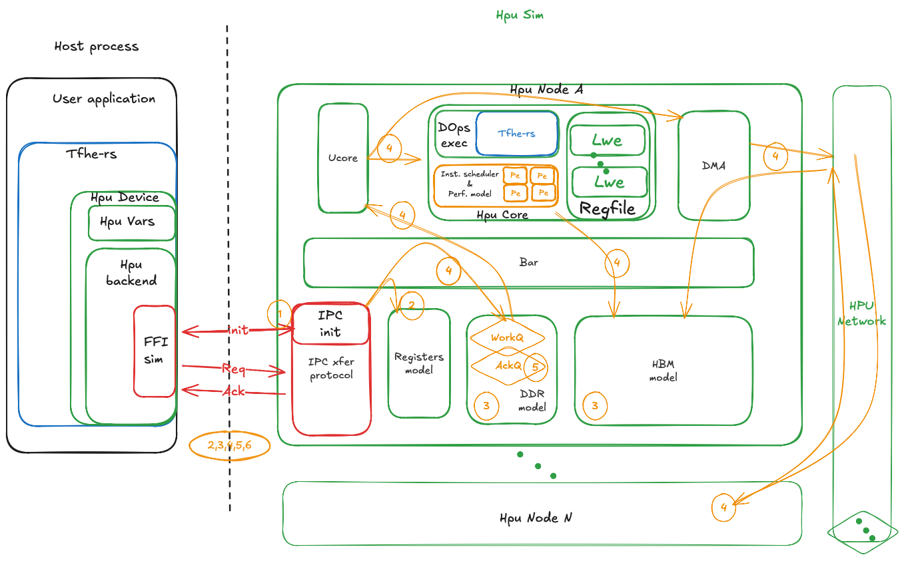

# Hpu Sim

## Brief

Simulation _drop-in-replacement_ implementation of HPU Hardware, supporting **multi-node** topologies and the network between them.

This simulator can be paired seamlessly with `tfhe-hpu-backend` compiled without any hardware support (i.e. without `hpu-v80` features). Without hardware support, `tfhe-hpu-backend` calls to low-level FFI are replaced by IPC calls that this simulator intercepts and answers.

Previously, a single-node simulation kernel was embedded directly inside the `tfhe-rs` repository. Multi-HPU modeling required a shift to a more advanced simulation kernel — the simulator now lives in its own repository and is built on top of the [`ra2m`](https://github.com/zama-ai/ra2m) framework, which provides a hierarchical, approximately-timed hardware modeling infrastructure with TLM-like communication.

Objectives of this simulator are as follows:

* **Transparent integration with user applications**
  > The user changes nothing in application code. Generated traces match those obtained on real hardware (timestamps excepted).

* **Stimulus generation**
  > Results are bit-accurate, enabling generation of golden stimuli for RTL simulation. RTL parameters are fully configurable at runtime.

* **Firmware development**
  > Accurate performance estimation and tracing capabilities assist development and optimization of HPU firmware.

* **Multi-HPU exploration**
  > The network between HPU nodes is modeled, enabling exploration of multi-node topologies and inter-HPU communication patterns.

### Simulator structure

Without hardware support `tfhe-hpu-backend` falls back to the `ffi-sim` interface. This interface binds to an IPC channel and forwards FFI calls over IPC using a simple Cmd/Payload message and Request/Ack protocol. The simulator binds to those IPC endpoints and answers requests as real hardware would.

The internal structure is organized around hierarchical modules built with `ra2m`:

* **`hpu_node`**: Top-level node abstraction (~ 1 Fpga board). Instantiates and connects all sub-modules: `HpuCore`, `UCore`, memory (DDR/HBM), and the network interconnect. Exposes network and host interfaces.
* **`hpu_core`**: Computation core. Holds the on-chip register file, an instruction stream (ISC) lookahead buffer, and integrates the `tfhe-rs` computation engine. Drives the performance model from `zhc_sim`.
* **`ucore`**: Embedded processor for instruction translation. Reads the IOp stream and translates it into concrete DOps, handling inter-HPU transfers (explicit and implicit), synchronization events, and variable-state tracking. Supports up to 256 IOp contexts.
* **`regmap`**: Register map interface. Loads hardware register definitions from file, manages key state (BSK, KSK, BPIP), and provides memory-mapped register access.

The simulator is a standalone binary that must be started **before** the user application. Running two separate binaries allows:
* A wide range of simulator configuration without touching application code.
* Distinct log streams: one for the simulator, one for the user application — application traces remain identical to those on real hardware.

Below is an overview of the internal structure.



After the simulator starts it registers an IPC configuration channel in a file readable by `ffi-sim` to establish a connection.
The IPC name is set in the TOML configuration file (example inside `tfhe-hpu-backend` folder)

```toml
[fpga.ffi.Sim]
ipc_name = "/tmp/${USER}/hpu_sim_ipc"
```

Once connected, the following steps occur:

1. Configuration channel exchanges a set of IPC endpoints: one for register access, one for memory management.
2. `tfhe-hpu-backend` reads registers over IPC to retrieve simulator parameters.
3. `tfhe-hpu-backend` allocates on-board memory, uploads the firmware translation table, the TFHE server keys, and the input ciphertexts.
4. Once input data is synced, `tfhe-hpu-backend` triggers IOp execution by pushing operations into the `WorkQ`:
   1. `ucore` retrieves the DOp stream from memory, reading and patching the firmware translation table to produce concrete DOps.
   2. The DOp stream is injected into the instruction scheduler (`isc_sim`) for execution-order resolution and performance estimation.
   3. `hpu_core` retrieves key material from memory (HPU format) and converts it back to CPU format.
   4. `hpu_core` executes DOps using `tfhe-rs` operations, reading ciphertexts from the register file (HPU format → CPU format on demand).
   5. For multi-node operations, inter-HPU transfers are routed through the network model before the dependent DOp can proceed.
5. When IOp execution finishes the simulator notifies `tfhe-hpu-backend` through the `AckQ`.
6. `tfhe-hpu-backend` retrieves results from simulated memory via IPC.

> **Note:** With the simulator, estimated IOp performance must be read from the simulator log, not from the user application report. The user application reports the wall-clock time of the simulator binary, not the expected performance on real HPU hardware.

### Simulator CLI and configuration

The simulator is configured by a single TOML file and a set of CLI knobs.

**`--config <PATH>`** (default: `$HPU_BACKEND_DIR/config_store/$HPU_CONFIG/hpu_config.toml`)

Same configuration file used by `tfhe-hpu-backend`. The simulator reads the `ffi-sim` settings, the register map definition, and the expected on-board memory layout from it.

**`--compute-params <NAME>`** (default: `TUniform64bFast`)
**`--perf-params <NAME>`** (default: `TUniform64bPFail128Psi64`)

Select the cryptographic and performance parameter sets. Parameters are embedded in the binary; no external file is needed. Available names:

| Name | Notes |
|------|-------|
| `Gaussian44bFast` | |
| `Gaussian64bFast` | |
| `Gaussian64bStandard` | |
| `Gaussian64bPFail64` | |
| `Gaussian64bPFail64Psi64` | |
| `TUniform64bFast` | Default compute params |
| `TUniform64bPFail64Psi64` | |
| `TUniform64bPFail128Psi64` | Default perf params |
| `Custom(<PATH>)` | Path to a user-provided TOML file |

Other optional knobs:

| Flag | Description |
|------|-------------|
| `--register <N>` | Override number of registers in the register file |
| `--isc-depth <N>` | Override instruction stream lookahead buffer depth |
| `--trivial` | Execute PBS with trivial ciphertexts (debug — no real crypto, fast) |
| `--noops` | Disable tfhe-rs computation (fast, false results, accurate timing) |
| `--dump-reg` | Dump register content after each DOp execution |
| `--timing-mode <MODE>` | [ra2m args] `LT` (LooselyTimed) or `AT` (ApproximatelyTimed, default) |
| `--duration <DUR>` | [ra2m args] Simulation run duration (default: `100_ms`) |
| `--timescale <TS>` | [ra2m args] Time resolution (default: `1_ps`) |
| `--frequency <FREQ>` | [ra2m args] Clock frequency for reporting (default: `400_MHz`) |
| `--log-args` | [ra2m args] Customize component logging with regex patterns |
| `--trace-args` | [ra2m args] Customize hardware tracing verbosity |

Simulation reports are written to `/tmp/hpu_sim`.


## Example

The following section explains how to run user application examples against the simulator backend.

> The use of the simulator instead of real hardware is transparent for the user application.
> Only the configuration file changes; no hardware-support feature flag should be set at compile time.

### HPU configuration selection

Select the simulation configuration with `setup_hpu.sh` from the `tfhe-rs` repository:

```bash
source setup_hpu.sh --config sim
```

### Start the simulator

```bash
# Build
cargo build --release --bin hpu_sim

# Run (minimal)
./target/release/hpu_sim

# Run with explicit params
./target/release/hpu_sim \
  --compute-params Gaussian64bFast \
  --perf-params TUniform64bPFail128Psi64 \
  [--register <N>] [--isc-depth <N>] \
  [--trivial | --noops] \
  [--dump-reg]
```

For convenience, `just build` and `just run` (or equivalent Justfile targets) are available — run `just` to list them.

Two typical simulation modes:

* **Fast/debug** (`--trivial` or `--noops`, fast compute params such as `Gaussian64bFast`):
  Useful for firmware iteration and correctness testing. Simulation is fast; results may be incorrect.

* **Accurate** (default compute/perf params, no overrides):
  Bit-accurate results and realistic performance estimates. Useful for RTL stimulus generation and firmware optimization. Simulation is slower.

### Start the user application

In a second terminal, start any application using the HPU backend. Example with `hpu_bench` from `tfhe-rs`:

```bash
cargo build --release --features="hpu" --example hpu_bench
# Run MUL and ADD IOps on 64-bit integers
./target/release/examples/hpu_bench --integer-w 64 --iop MUL --iop ADD
```

## Test

The HPU test framework from `tfhe-rs` works against the simulator using the same configuration mechanism.

Open two terminals:
1. Start the simulator: `just mockup` (or the equivalent target)
2. Start the test framework:

```bash
# Run all integer widths
cargo run --release --features="hpu" --test hpu

# Run for a specific width
cargo run --release --features="hpu" --test hpu -- u8

# Filter by sub-category (alus, alu, bitwise, cmp, ternary, algo)
cargo run --release --features="hpu" --test hpu -- cmp
```

## Development

```bash
just fmt            # format code
just fmt-check      # check formatting (CI)
just clippy         # lint (warnings as errors)
just check          # type-check only
just test           # run test suite
just ci             # full CI gate: fmt-check → clippy → test
just doc            # build and open rustdoc
```

Install git hooks (recommended):

```bash
just git-hook-init
```

## License

BSD-3-Clause-Clear — see [LICENSE](LICENSE).
